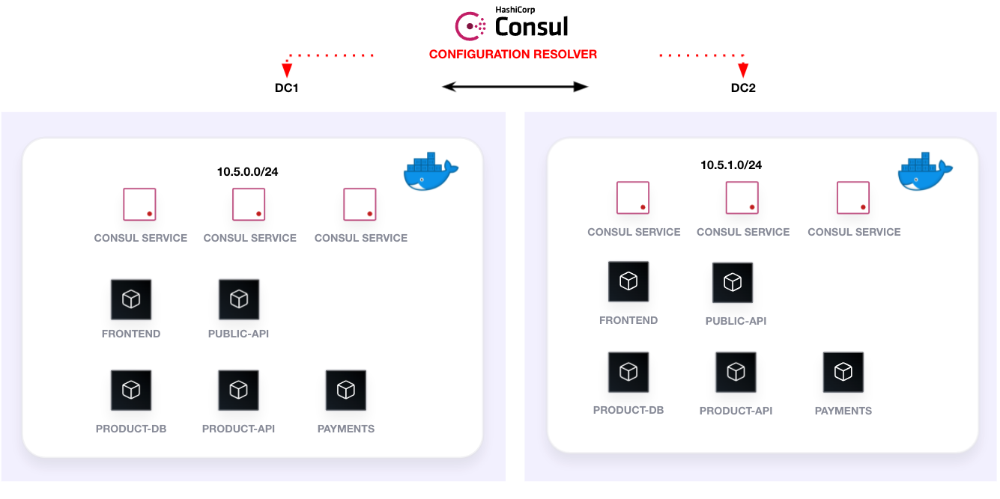

## Docker Compose Local Setup

This Docker Compose solution deploys HashiCups with Consul. HashiCups is deployed redunantly with a secure Consul deployment. This includes mTLS, encrypted Gossip communciation, and the usage of ACLs.
The Docker images utilized are not publicly available and must be created locally. 



To get started, please follow the steps below.

## Requirements

- Docker

## Create images

To generate the required Docker images use the `build_images.sh` script.

```
./build_images.sh
```

## Start Docker Compose

To start Docker compose use the command below:

```bash
docker-compose up --detach
```

**NOTE**: It takes approximately 5-10 seconds for all services to come up.

Visit the Consul dashboard at http://localhost:8500 and ensure all services are up. 

Next, go to http://localhost to visit HashiCups.

Author: Karl Cardenas

## Stop Docker Compose

To stop the Docker compose, use the command below:

```
docker-compose down
```

## Debugging

If the product-api service fails to come up then it's most likely due to the product-db container having issues.
Follow the steps below to get the product-api service up and running.


1. Stop the product-api and product-db service

```
docker rm product-api --force && \
docker rm product-db --force
```

1. Start the product-db service

```
docker-compose up --no-recreate
```

**TIP**: Use the command `docker logs [container_name]` to debug container start issues.

## mTLS

The Consul certificates were generated with the following commands:

```shell
consul tls ca create
consul tls cert create -server -dc dc1 -additional-dnsname="*.dc2.consul" -additional-dnsname="consul_server_0"
consul tls cert create -server -dc dc1 -additional-dnsname="*.dc2.consul" -additional-dnsname="consul_server_1"
consul tls cert create -server -dc dc1 -additional-dnsname="*.dc2.consul" -additional-dnsname="consul_server_2"
consul tls cert create -server -dc dc2 -additional-dnsname="*.dc1.consul" -additional-dnsname="consul_secondary_server_1"
consul tls cert create -server -dc dc2 -additional-dnsname="*.dc1.consul" -additional-dnsname="consul_secondary_server_1"
consul tls cert create -server -dc dc2 -additional-dnsname="*.dc1.consul" -additional-dnsname="consul_secondary_server_1"

```