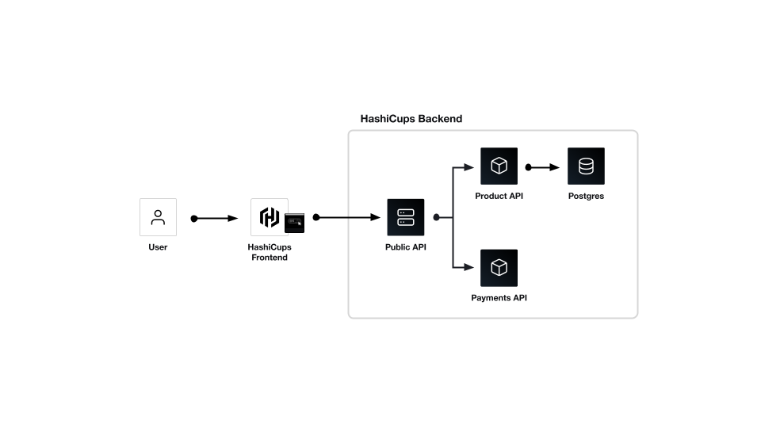

## Introduction 

HashiCups is a coffee order management system for fictional customers. 
The HashiCups application is only used for demonstration purposes, such as tutorials, webinars, and demos.
HashiCups was designed in a microservices architecture with the intent to help you showcase the strength of HashiCorp products.

This page will provide you with an overview of the HashiCups architecture and a better understand of the services that makeup HashiCups.

## Architecture

HashiCups is made up by five different microservices; **frontend**, **public-api**, **product-api**, **payments**, and **postgress**. 
Each service depends on another service. As a result, you must deploy all services to have a functional HashiCups application.

The following image displays the information and connectivity flow of HashiCups.

### Frontend service

The frontend service is a React.js application that interacts with the **public-api** through GraphQL API requests. Users are, by default, unauthenticated when the application loads in the browser.  As an unauthenticated user, you can only browse the coffee selection list. To purchase a coffee, the user must log into the application.

To purchase a coffee or a set of coffees, the user must log in to the application. HashiCups does not come with a default user id created. Therefore users must make their user through the login option in the righthand side navigation menu.

The frontend service is designed to be a client application. Thus, all API calls from the frontend service will originate from the user's browser. The frontend service can be configured to be consumed with a reverse proxy, so API requests to the **public-api** are sourced from the reverse proxy instance.. An example of this setup is available in the [docker-compose-deployment-reverse-proxy-nginx](../docker-compose-deployment-reverse-proxy-nginx/README.md) folder.

### Public-api service

### Product-api service

### Payments service

### Postgres service