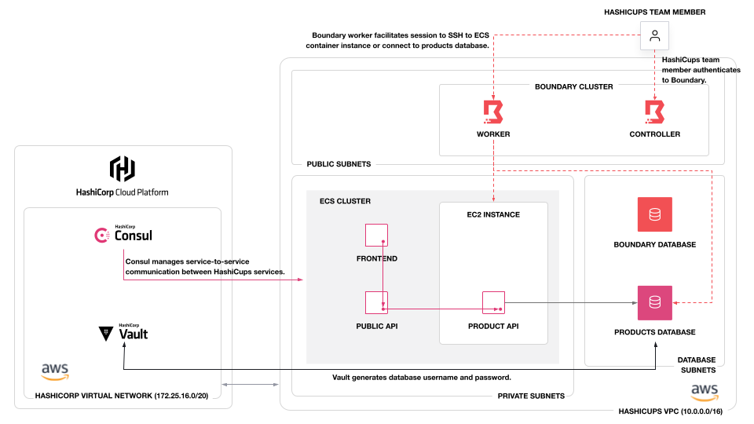

## Terraform Set up for HCP, Amazon ECS, and Boundary

This configuration deploys and configures the following:

- HashiCorp Cloud Platform network, Consul cluster, and Vault cluster
- Boundary cluster on EC2 instances and Amazon RDS (PostgreSQL) database
- Amazon ECS cluster with 1 EC2 container instance
- Amazon RDS database (PostgreSQL)



## Deploying Infrastructure

Set your AWS CLI environment variables to authenticate to AWS.

Navivate to this folder using your CLI.

Navigate to the `infrastructure/` directory.

```shell
cd infrastructure
```

Customize your Terraform variables, such as which CIDR blocks you
want to allow to your ECS cluster and Boundary.

```shell
cp example.tfvars terraform.auto.tfvars
```

Run Terraform.

```shell
terraform apply
```

## Configure Boundary

We use Boundary connect to the HashiCups PostgreSQL database and
SSH into the EC2 container instance.

Navivate to this folder using your CLI.

Navigate to the `boundary/` directory.

```shell
cd boundary
```

Customize your Terraform variables, such as the ECS cluster
and products PostgreSQL database. You can retrieve these variables
from the `terraform output` of the `infrastructure/` folder.

```shell
cp example.tfvars terraform.auto.tfvars
```

Run Terraform.

```shell
terraform apply
```

## Configure Vault

We use Vault generate database credentials for the HashiCups PostgreSQL
database.

Navivate to this folder using your CLI.

Navigate to the `vault/` directory.

```shell
cd vault
```

Customize your Terraform variables, such as the ECS cluster
and products PostgreSQL database. You can retrieve these variables
from the `terraform output` of the `infrastructure/` folder.

```shell
cp example.tfvars terraform.auto.tfvars
```

In your CLI, run the script to set the Vault address, token, and namespace.

```shell
source set.sh
```

Run Terraform.

```shell
terraform apply
```

## Populate Database

We use Boundary to log into the database as a "developer" and run a SQL script to populate
the tables in the database.

Navivate to this folder using your CLI.

Navigate to the `database/` directory.

```shell
cd database
```

In your CLI, run the script to populate the database.

```shell
source set.sh
```

## Deploy Applications

We use Consul manage service-to-service communications with the HashiCups applications.

Navivate to this folder using your CLI.

Navigate to the `apps/` directory.

```shell
cd apps
```

In your CLI, run the script to get a new database username and password from Vault for the
`product-api` to connect to the database.

```shell
source set.sh
```

Customize your Terraform variables, such as the ECS cluster
and products PostgreSQL database. You can retrieve these variables
from the `terraform output` of the `infrastructure/` folder.

```shell
cp example.tfvars terraform.auto.tfvars
```

Run Terraform.

```shell
terraform apply
```

## Clean-up

To clean up and remove the HashiCups resources use the command below.

```
bash clean.sh
```

